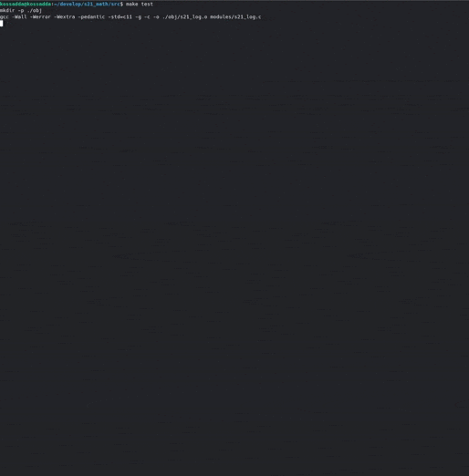
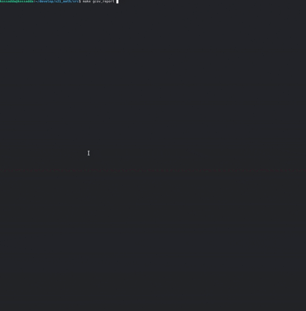

# s21_math

Реализация библиотеки s21_math.h.

Английскую версию README можно найти в репозитории. 

## Содержание
1. [Описание проекта](#описание-проекта)
2. [Команда разработки](#команда-разработки)
3. [Сборка проекта](#сборка-проекта)
4. [Тестирование](#тестирование)
5. [Обратная связь](#обратная-связь)

## Описание проекта 

Цель данного проекта состоит в разработке своей версии стандартной библиотеки math.h на языке программирования Си. Эта библиотека реализует базовые математические операции, которые затем используются в различных алгоритмах. В рамках выполнения этого проекта предполагается знакомство с основами вычислительных методов и закрепление подходов структурного программирования.  

### Обзор реализованных функций "math.h"

Математические операции на языке Си представляют собой группу функций в стандартной библиотеке языка программирования Си, реализующих основные математические функции. Все функции так или иначе используют числа с плавающей запятой. Различные стандарты C предоставляют различные, хотя и обратно совместимые, наборы функций. Любые функции, которые работают с углами, используют радианы в качестве единицы измерения угла.  

| №  | Функция                                    | Описание                                                                             |
|----|--------------------------------------------|--------------------------------------------------------------------------------------|
| 1  | `int abs(double x)`                        | Вычисляет абсолютное значение целого числа.                                          |
| 2  | `long double fabs(double x)`               | Вычисляет абсолютное значение числа с плавающей точкой.                              |
| 3  | `long double floor(double x)`              | Возвращает ближайшее целое число, не превышающее указанное число с плавающей точкой. |
| 4  | `long double ceil(double x)`               | Возвращает ближайшее целое число, не меньшее указанного числа с плавающей точкой.    |
| 5  | `long double exp(double x)`                | Возвращает значение e, возведённое в указанную степень.                              |
| 6  | `long double fmod(double x, double y)`     | Остаток от операции деления числа с плавающей точкой.                                |
| 7  | `long double log(double x)`                | Вычисляет натуральный логарифм числа с плавающей точкой.                             |
| 8  | `long double sqrt(double x)`               | Вычисляет квадратный корень числа с плавающей точкой.                                |
| 9  | `long double pow(double base, double exp)` | Возводит число в заданную степень.                                                   |
| 10 | `long double sin(double x)`                | Вычисляет синус числа с плавающей точкой.                                            |
| 11 | `long double cos(double x)`                | Вычисляет косинус числа с плавающей точкой.                                          |
| 12 | `long double tan(double x)`                | Вычисляет тангенс числа с плавающей точкой.                                          |
| 13 | `long double asin(double x)`               | Вычисляет арксинус числа с плавающей точкой.                                         |
| 14 | `long double atan(double x)`               | Вычисляет арктангенс числа с плавающей точкой.                                       |
| 15 | `long double acos(double x)`               | Вычисляет арккосинус числа с плавающей точкой.                                       |

### Особенности реализации

В ходе написания проекта было принято решение произвести реализацию функции при помощи работы с отдельными битами чисел с плавающей точкой. Данный метод нацелен на более плотное изучение архитектуры языка и способа хранения чисел с плавающей точкой в памяти компьютера.

> Речь идет про IEEE Standard for Floating-Point Arithmetic (IEEE 754).
>
> Стандарт описывает:
> - формат чисел с плавающей точкой: мантисса, экспонента (показатель), знак числа;
> - представление положительного и отрицательного нуля, положительной и отрицательной бесконечностей, а также нечисла́ (англ. Not-a-Number, NaN);
> - методы, используемые для преобразования числа при выполнении математических операций;
> - исключительные ситуации: деление на ноль, переполнение, потеря значимости, работа с денормализованными числами и другие;
> - операции: арифметические и другие.

Для работы с битами была применена стандартная библиотека ieee754.h, содержащая union структуру чисел с плавающей точкой (одинарной, двойной и расширенной точности). Данная структура позволяет нам обращаться непосредственно к необходимым полям (знака, мантиссы, экспоненты) и производить необходимые битовые операции для получения необходимых в рамках заданного алгоритма значения чисел.

### Детали проекта

- Библиотека разработана на языке Си стандарта C11 с использованием компиятора gcc;
- Код библиотеки находится в папке `src` в ветке `develop`;
- Не используются устаревшие и выведенные из употребления конструкции языка и библиотечные функции. В реализации обращено внимание на пометки legacy и obsolete в официальной документации по языку и используемым библиотекам. Код ориентируется на стандарт `POSIX.1-2017`;
- Форматирование кода произведено в соответствии с Google Style;
- Решение оформлено в виде статической библиотеки (с заголовочным файлом `s21_math.h`);
- Библиотека разработана в соответствии с принципами структурного программирования, исключено дублирование кода;
- Перед каждой функцией используется префикс `s21_`;
- Обеспечено полное покрытие unit-тестами функций библиотеки c помощью библиотеки `Check`;
- Unit-тесты проверяют результаты работы реализации путём сравнения ее с реализацией стандартной библиотеки math.h;
- Unit-тесты покрывают не менее 80% каждой функции;
- В цели gcov_report формируется отчёт gcov в виде html страницы. Для этого unit-тесты запускаются с флагами gcov;  
- Предусмотрен Makefile для сборки библиотеки и тестов (с целями all, clean, test, s21_math.a, gcov_report);  
- Исключено копирование реализации и использование стандартной библиотеки math.h везде, кроме unit-тестов;  
- Соблюдена логика работы стандартной библиотеки;
- Общая проверяемая точность - `16` значащих цифр;
- Проверяемая точность дробной части - `6` знаков после запятой.

## Команда разработки

Состав команды, реализовавшей проект:  
**kossadda** (https://github.com/kossadda)  
**emmonbea** (https://github.com/emmonbear)  

## Сборка проекта

В Makefile добавлены следующие основные цели для работы с проектом:

| #  | Цель            | Описание цели                                                                |
|----|-----------------|------------------------------------------------------------------------------|
| 1  | `all`           | Формирует документацию к проекту и запускает тестирование модулей.           |
| 2  | `s21_math`      | Осуществляет сборку модулей в статическую библиотеку.                        |
| 3  | `test`          | Производит тестирование модулей.                                             |
| 4  | `gcov_report`   | Производит тестирование модулей и формирует отчет о покрытии в html формате. |
| 5  | `dvi`           | Формирует документацию в формате html и manual к функционалу.                |
| 6  | `rebuild`       | Пересборка проекта.                                                          |
| 7  | `clang_check`   | Тестирование модулей на соответствие Google style.                           |
| 8  | `valgrind`      | Тестирование модулей на работу с памятью через Valgrind.                     |
| 9  | `install`       | Производит установку необходимых зависимостей для тестирования проекта.      |
| 10 | `clean`         | Производит очистку репозитория от сгенерированных файлов.                    |

## Тестирование

Написанный код был протестирован unit-тестами с использованием библиотеки check.  

  

Произведено покрытие кода тестами с выводом в html отчет при помощи gcovr.  

  

Код протестирован на наличие ошибок/утечек через valgrind.  

  

## Обратная связь

Если имеются вопросы касаемо особенностей или других интересующих вас моментов проекта, то обращайтесь на почту:

moskaleviluak@icloud.com  
gabilov1997@gmail.com  

Спасибо за внимание. Надеюсь, что данный проект вам понравится и будет полезен.

 

[К оглавлению](#s21_math)